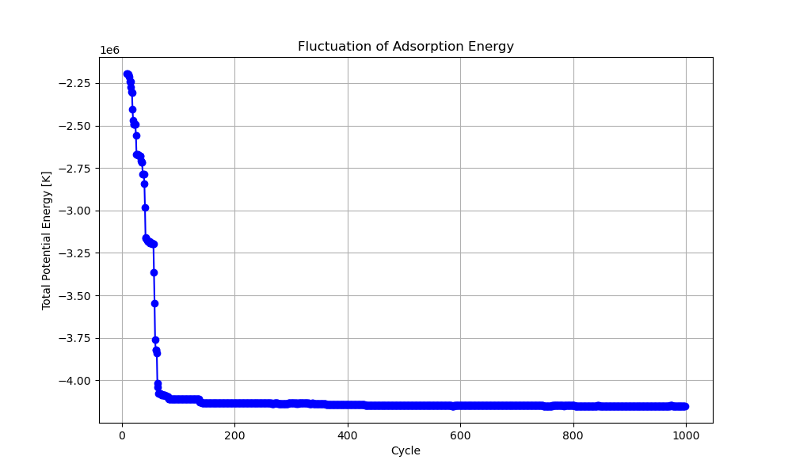

# Zeolite_Adsorbate_Init

<h1 style="display: inline;">
    
    Your Heading
</h1>


Reference : https://github.com/haoyuanchen/RASPA-tools/tree/master/MOFBigAdsorbateInitializer

Check example folder

## Necessary tools
Raspa 2, Python

## Files needed to start a RASPA calcualtion
  1. guest molecule .def file
  2. framework's .cif file (cif files generated from ASE will cause some issue *Will be expanding on how to fix it later*)
  3. force_field.def or mixing_rule.def 
  4. pseudo_atom.def file
  5. simulation.input file

## For running RASPA calcualtion on HPC:

```bash
#!/bin/bash
#SBATCH --job-name=cha_prop
#SBATCH --nodes=1
#SBATCH --ntasks-per-node=1
#SBATCH --partition=shared
#SBATCH --mem-per-cpu=4GB
#SBATCH --export=ALL
#SBATCH --time=2:00:00
#SBATCH -A bbukows1
#SBATCH --mail-type=END,FAIL
#SBATCH --mail-user=aroy34@jh.edu

ml purge
module load slurm/19.05.7 helpers intel/2020.1 intel-mpi/2019.8.254 hdf5/1.10.7 libbeef/0.1.2 dftd4/3.3.0

module list
which mpirun

/home/aroy34/.conda/pkgs/raspa2-2.0.50-h678ec8c_0/bin/simulate simulation.input

# Above path to RASPA simulate file will be different for your system
```

## For visulising the energy fluctuation
python data.py or sbatch python.run



## For generating combined .cif file (framework + adsorbate)

Run python cifgen.py al-cha.cif 999

{ python cifgen.py framwork.cif [cycle number - 1] }


## Ready for DFT calcualtions
Convert the cif filethat you generated int he above step to POSCAR file or directly use the cif file for runnign DFT calcualtions


